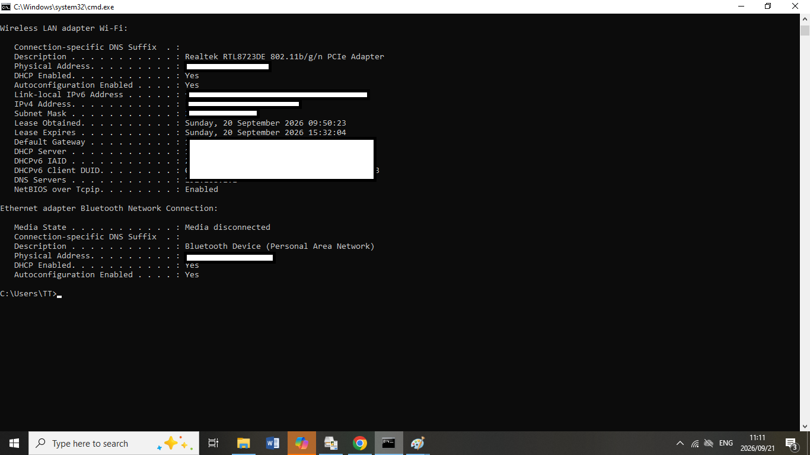
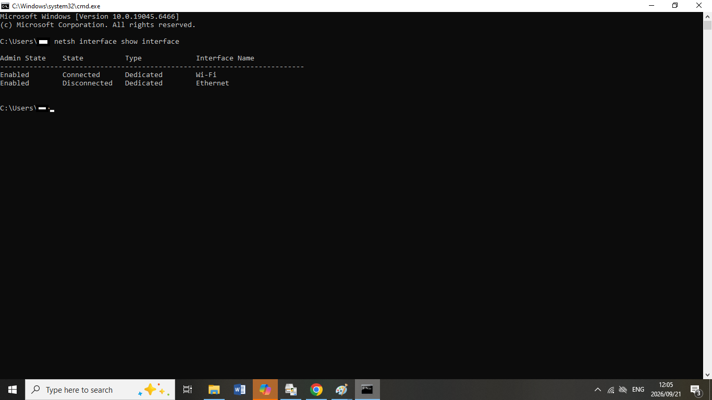
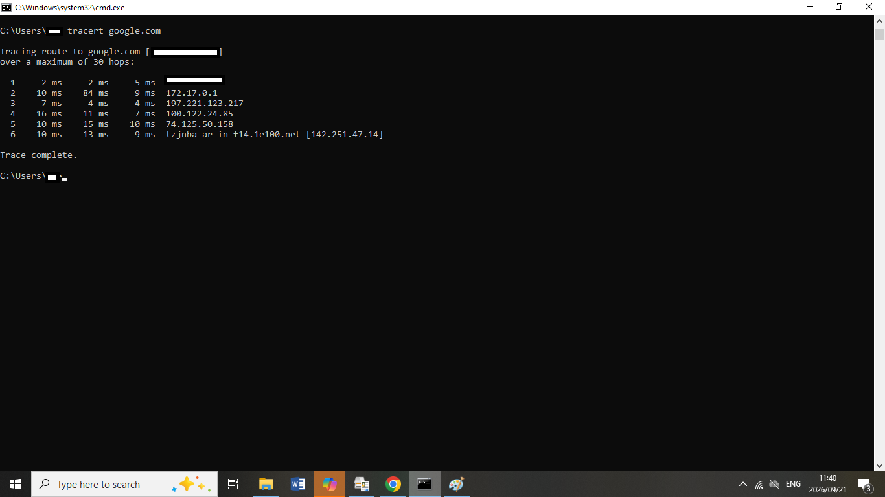
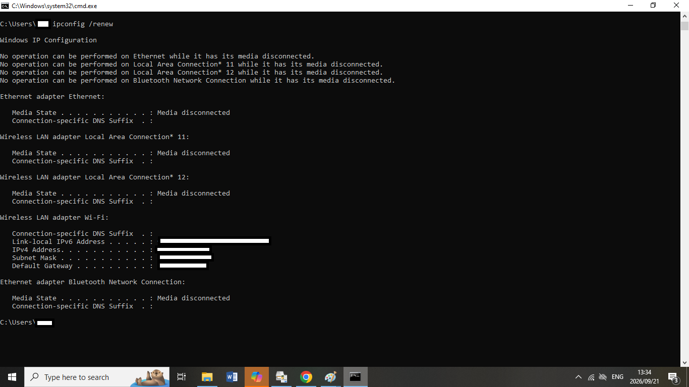

# Network-Troubleshooting-Lab
A hands-on network troubleshooting lab demonstrating IP configuration, connectivity testing, DNS troubleshooting, DHCP, and network diagnostic commands.

## 📌 Project Overview

This project demonstrates practical network troubleshooting skills using Windows networking tools and commands.

The purpose of this lab is to simulate common IT Support network problems and document a structured troubleshooting process to identify possible causes and verify solutions.

This project was created as part of my ongoing development in IT Support, networking, and cybersecurity.

---

## 🎯 Objectives

The objectives of this lab are to:

- Understand basic IP configuration
- Troubleshoot network connectivity
- Test communication between devices
- Troubleshoot DNS resolution
- Understand DHCP configuration
- Trace network paths
- Interpret basic network diagnostic results
- Document troubleshooting procedures

---

## 🛠️ Tools Used

- Windows 10/11
- Command Prompt
- `ipconfig`
- `ipconfig /all`
- `ping`
- `nslookup`
- `tracert`

---

## 🔎 Troubleshooting Methodology

I use a structured troubleshooting approach when investigating network problems:

1. Identify the problem
2. Establish a theory of probable cause
3. Test the theory
4. Establish a plan of action
5. Implement the solution
6. Verify full system functionality
7. Document the findings

---

## 🧪 Network Troubleshooting Scenarios

### Scenario 1 — No Network Connectivity

#### Problem

A user reports that their computer cannot access network resources or the internet.

#### Step 1 — Check IP Configuration

The first step is to check whether the computer has a valid IP configuration.

**Command used:** `ipconfig`

#### Information Checked

- IPv4 address
- Subnet mask
- Default gateway

#### What I Am Looking For

A valid IP configuration should contain an IPv4 address, subnet mask, and default gateway appropriate for the network.

---

### Scenario 2 — Test Network Connectivity

After checking the IP configuration, the next step is to test connectivity.

**Command used:** `ping 8.8.8.8`

#### Purpose

The `ping` command is used to test whether the computer can communicate with the destination.

#### Results

The test returned successful replies with no packet loss, demonstrating connectivity to the destination.

---

### Scenario 3 — DNS Troubleshooting

A computer may have internet connectivity but still be unable to access websites if DNS resolution is not working correctly.

**Command used:** `nslookup google.com`

#### Purpose

The `nslookup` command is used to query DNS and determine whether a domain name can be resolved to an IP address.

#### Results

The DNS query successfully resolved `google.com`, demonstrating that DNS name resolution was functioning during the test.

---

### Scenario 4 — Trace Network Path

The `tracert` command can be used to identify the path traffic takes from the computer to a destination.

**Command used:** `tracert google.com`

#### Purpose

`tracert` helps identify the network hops between the local computer and the destination.

It can help an IT Support technician investigate where communication may be experiencing delays or failure.

---

## 📋 Network Troubleshooting Commands

| Command | Purpose |
|---|---|
| `ipconfig` | Displays IP configuration |
| `ipconfig /all` | Displays detailed network configuration |
| `ping` | Tests network connectivity |
| `nslookup` | Tests DNS name resolution |
| `tracert` | Displays the network path to a destination |

---

## 📸 Hands-On Evidence

### 1. Detailed IP Configuration

### 2. Network Adapter Status

### 3. Network Path Testing

### 4. DHCP Troubleshooting

---

## 📚 Skills Demonstrated

This project demonstrates practical knowledge of:

- TCP/IP fundamentals
- IPv4 addressing
- Subnetting fundamentals
- Default gateways
- DNS
- DHCP
- Network connectivity testing
- Network path analysis
- Windows command-line tools
- IT troubleshooting methodology
- Technical documentation

---

## 🚀 Future Improvements

I plan to expand this lab with:

- Subnetting exercises
- DHCP troubleshooting
- DNS troubleshooting scenarios
- Static IP configuration
- Network diagrams
- Packet capture analysis
- Wireshark exercises
- Basic network security troubleshooting

---

## 👤 About Me

I am developing my skills in IT Support, networking, and cybersecurity through hands-on labs and practical troubleshooting exercises.

My goal is to apply these skills in a professional IT Support environment while continuing to develop my technical knowledge.
